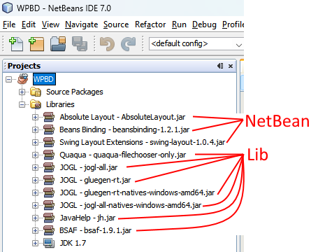

# Bridge Designer
## Sites d'origine
* [Bridge contest](https://www.bridgecontest.org).
* [Source forge](https://sourceforge.net/projects/wpbdc/). Le site de la source.
* [Github](https://github.com/egeland/bridge-designer). Une autre version de la source.

## Description
* Simulation de pont 2D.
* [Vidéo de présentation](https://bridgedesigner.org/tutorial/)

## Mes modifications
* Traduction en français.
* Ajout de matériaux pour les maquettes (carton et MDF).
* Suppression de la signature des fichiers (voir le **build - Original.xml** pour la restaurer).
* Modif cosmétique (image du pont de saint-nazaire, modif du cartouche et modif du setupWizard pour correspondre à nos TP).

## Comment compiler  
* Récupérer le projet sur github.
* Installer JDK 1.6.
* Installer NetBean 7.0.
* Ouvrir Netbean et de lui, le projet WPBD.
* Restaurer le lien vers JDK 1.6 :
    * Clic droit sur le projet > Properties,
    * Dans le fenêtre à gauche choisir librairies,
    * Choisir le jdk 1.6 que vous venez d'installer,
* Restaurer les liens vers les librairies.

    Les librairies NetBeans doivent être ok. Le dossier **lib** est celui sous la racine du projet. 
    
    
        